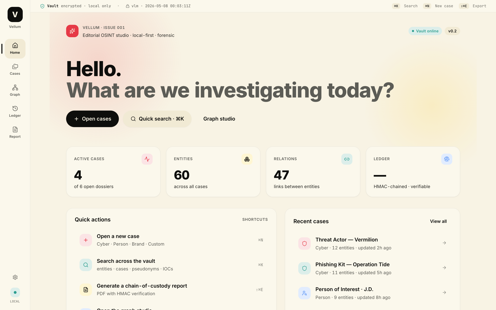

# Vellum

> Editorial OSINT studio — local-first, forensic-grade, beautifully designed.



OSINT tools shouldn't look like 2008 forum software. Vellum is a desktop application for open-source intelligence work: calm by design, forensic by default, and entirely local — your vault never leaves your machine without your signed consent.

---

## Features

### Multi-case workspace
Four investigation templates out of the box — **Cyber**, **Person**, **Brand**, **Custom** — each with its own entity graph, enrichment profile, and report template. Cases are pinnable, sortable, archivable, and searchable via ⌘K.

### Encrypted local vault
All data is stored in a **SQLCipher-encrypted SQLite database** (AES-256, WAL mode, foreign-key enforced). The master key is derived via Argon2id and stored in the OS keychain — never written to disk in plaintext.

### HMAC-chained forensic ledger
Every action (entity creation, enrichment, status change, note, attachment) is appended to an **immutable event log**. Each event carries an HMAC computed over `prev_hash ‖ payload ‖ timestamp` — tamper with one entry and the entire chain breaks, provably. The ledger is surfaced in the Timeline screen and embedded in PDF reports.

### Interactive entity graph
Force-directed layout (custom seeded simulation, 280 iterations, no d3 dependency) with:
- **Pan & zoom** via scroll wheel + drag
- **Degree-sized nodes** — hubs are visually larger
- **Selection & hover** dimming of unrelated nodes/edges
- **Kind filter legend** floating on the canvas (click to toggle visibility)
- **Inspector panel** (slide-in) with entity metadata, connected edges, and quick actions

### Command palette (⌘K)
Universal search across cases, entities, pseudonyms, and IOCs. Also exposes keyboard-driven actions: new case (⌘N), export (⇧⌘E), graph (⌘3), settings (⌘,).

### Report composer
Split-view PDF builder with A4 preview, HMAC verification stamp, and six structured sections: cover, entities index, relations map, timeline, hash-chain verification, appendix.

---

## Stack

| Layer | Technology |
|---|---|
| Desktop shell | Tauri 2 (Rust + WebView) |
| Database | SQLite via `rusqlite` + `bundled-sqlcipher` |
| Crypto | Argon2id key derivation · HMAC-SHA256 chain · OS keychain |
| Frontend | React 18 · TypeScript · Vite |
| State | Zustand |
| Animations | Framer Motion |
| Graph | SVG force simulation (custom, seeded PRNG) |
| Typography | Inter · JetBrains Mono |
| Icons | Lucide React |

**Palette** — `ink #0E0E0C` · `paper #F5EFE0` · `ember #E63946` · `solar #FFD23F` · `moss #2A9D8F` · `sky #3A86FF`

---

## Getting started

### Web preview (no Rust required)

```bash
npm install
npm run dev          # → http://localhost:1420
```

All screens are fully navigable in browser mode. The vault backend is mocked; data is seeded from `src/lib/mockData.ts`.

### Desktop app (Tauri)

Requires [Rust toolchain](https://rustup.rs).

```bash
# Install Rust (once)
curl --proto '=https' --tlsv1.2 -sSf https://sh.rustup.rs | sh

# Run in dev mode (hot-reload front + Tauri shell)
npm run tauri:dev

# Build a distributable
npm run tauri:build
```

---

## Project structure

```
src/
├── app/
│   ├── App.tsx               # Root — shell, palette, toasts, shortcuts
│   ├── router.ts             # Zustand router (cover|cases|caseDetail|graph|timeline|reports|settings)
│   └── shell/                # AppShell, StatusBar, NavRail
├── features/
│   ├── cover/                # Home screen — KPIs, quick actions, recent cases
│   ├── cases/                # Case list — sort, pin, filter, archive with undo
│   ├── caseDetail/           # Case dossier — entities, recent activity, quick add
│   ├── graph/                # Graph studio — force layout, inspector, kind filter
│   ├── timeline/             # Forensic ledger — HMAC events, filter pills
│   ├── reports/              # Report composer — A4 preview, PDF / Markdown export
│   └── settings/             # Vault path, cipher info, connectors, danger zone
├── ui/
│   ├── tokens/               # colors.ts · typography.ts · layout.ts · motion.ts · space.ts
│   ├── primitives/           # Button · Card · Badge · IconTile · ListRow · Tooltip · Spinner
│   ├── typography/           # Display · H1 · H2 · H3 · Eyebrow · Body · BodySmall · Mono
│   └── shapes/               # PaperGrid · Orb
└── lib/
    ├── casesStore.ts         # Cases CRUD, pin/archive/sort, density
    ├── entitiesStore.ts      # Per-case entities, relations, events
    ├── commands.ts           # ⌘K command registry
    ├── graphLayout.ts        # Force-directed layout (seeded PRNG, 280 iterations)
    ├── mockData.ts           # 6 rich thematic seed cases (Cyber, Person, Brand, Custom)
    ├── toasts.ts             # Toast queue
    └── types.ts              # Shared domain types

src-tauri/
├── src/
│   ├── main.rs               # Tauri bootstrap
│   ├── db/                   # SQLCipher pool, schema, migrations
│   ├── domain.rs             # Case · Entity · Relation · Event types
│   ├── ledger.rs             # HMAC chain — append(), verify_chain()
│   ├── repo.rs               # CRUD with ledger event per mutation
│   ├── crypto.rs             # Argon2id key derivation + OS keychain
│   └── ipc.rs                # #[tauri::command] handlers (13 commands)
└── tests/
    └── persistence.rs        # Integration tests (vault open, CRUD, chain integrity)
```

---

## Keyboard shortcuts

| Shortcut | Action |
|---|---|
| `⌘K` | Open command palette |
| `⌘N` | New case |
| `⌘1` | Home |
| `⌘2` | Cases |
| `⌘3` | Graph studio |
| `⌘4` | Timeline ledger |
| `⌘5` | Reports |
| `⌘,` | Settings |
| `⇧⌘E` | Export report |
| `⌘D` | Load demo case |

---

## Roadmap

| Version | Status | Focus |
|---|---|---|
| V0.1 | ✅ | Tauri scaffold · design system · 5 screens |
| V0.2 | ✅ | SQLCipher vault · HMAC ledger · Cases CRUD · graph · mock data |
| V0.3 | 🔜 | Cytoscape (10k+ node canvas) · dark mode · key rotation |
| V0.4 | 📋 | 6 enrichers: HIBP · Hunter · Whois · Shodan · Wayback · Maigret |
| V0.5 | 📋 | PDF chain-of-custody · Tantivy full-text search |
| V0.6+ | 📋 | CaseKind templates · onboarding · theme system |

---

## Architecture notes

See [`docs/architecture/intel-graph.md`](docs/architecture/intel-graph.md) for the graph intelligence layer design.

The forensic ledger schema:

```sql
CREATE TABLE events (
  id          INTEGER PRIMARY KEY,
  case_id     TEXT NOT NULL,
  kind        TEXT NOT NULL,
  actor       TEXT NOT NULL DEFAULT 'user',
  payload     TEXT NOT NULL DEFAULT '{}',
  ts          TEXT NOT NULL,
  prev_hash   TEXT NOT NULL,
  hash        TEXT NOT NULL
);
-- UPDATE and DELETE are blocked by SQL triggers (append-only guarantee)
```

`hash = HMAC-SHA256(prev_hash ‖ payload ‖ ts)` — re-verifiable at any point via `vellum verify`.

---

## License

MIT © 2026 — Hector
